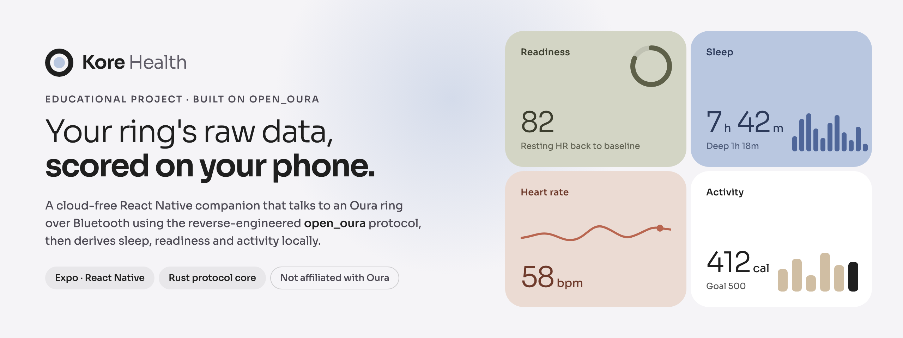

<p align="center">
  
</p>

# Kore Health

Kore is an **educational** React Native app that explores what an Oura ring exposes over Bluetooth. It pairs with the ring directly, drains its raw history stream, and computes its own sleep, readiness and activity estimates on the phone, with no account and no cloud.

It exists to learn from and build on [open_oura](https://github.com/Th0rgal/open_oura), the community reverse-engineering of the Oura BLE protocol.

> [!IMPORTANT]
> **Kore is not a product and is not for production or clinical use.**
>
> - It is an independent learning project. It is **not affiliated with, endorsed by, or supported by Oura Health Oy**. "Oura" is a trademark of its owner and is used here only to describe compatibility.
> - It is **not a medical device**. Every score in the app is a transparent local heuristic, not Oura's algorithm, and must not be used for health decisions.
> - It talks to the ring using a **reverse-engineered protocol**. Pairing installs a new auth key, so a ring already set up with the official app has to be factory reset first, which removes it from that app. Only use a ring you are comfortable experimenting with.
> - Builds are shared with a small group of invited testers through TestFlight. It is not, and will not be, on the App Store.

## What it does

- **Pairs and authenticates** with a ring over BLE (scan → connect → nonce challenge → key install).
- **Syncs history incrementally** from a persisted cursor: heart rate per beat, HRV, skin temperature, SpO₂, motion, MET levels and bedtime windows.
- **Derives scores locally**: sleep staging, sleep/readiness/activity summaries and temperature deviation, all folded onto a shared 3-minute grid.
- **Streams live heart rate** while the ring is connected.
- **Recovers from stuck syncs**: you can stop a sync, a watchdog ends one that has stalled, and progress is saved in chunks. A debug console can reset the app and share a redacted sync log.

## How it works

```
Oura ring ──BLE──▶ react-native-ble-plx (JS transport)
                     │
                     ▼
               src/ring/client.ts ── auth, requests, drain loop
                     │   ▲
                     │   └── @kore/oura-core (Rust `oura-protocol` via Craby TurboModule)
                     ▼
               src/data/ring.ts ─── fold events onto a 3-min grid
                     │
                     ▼
               src/data/scores.ts ─ sleep staging, daily summaries
                     │
                     ▼
               src/store/health.ts  zustand + AsyncStorage (one write per sync)
```

- **BLE transport lives in JavaScript** via `react-native-ble-plx`. Running `btleplug` on-device was rejected because its Android backend needs a JNI/Java hybrid build that a Craby module cannot provide.
- **Only the pure protocol crate is native.** `packages/oura-core` wraps open_oura's `oura-protocol` crate as a C++ TurboModule generated by [Craby](https://craby.rs/). Its surface is byte-oriented (hex in, hex or JSON out), so no complex types cross the FFI.
- **Sync orchestration is TypeScript** and mirrors open_oura's `oura-link` client: connect, authenticate, sync the clock, drain events, apply the result.
- **The ring does not compute Oura's 0–100 scores or a hypnogram.** Kore derives its own from the raw streams, and the heuristics are documented inline in `src/data/scores.ts`.

The expected behavior is written down as BDD contracts in [`docs/bdd`](docs/bdd), and each scenario is mapped to tests or code evidence.

## Repository layout

```
apps/mobile                Expo SDK 57 app (expo-router, React Native 0.86)
  src/app                  Screens: home, sleep, readiness, activity, trends,
                           metric/[id], pair, ring-debug
  src/ring                 BLE transport, protocol client, sync, background task,
                           on-device sync log
  src/data                 Event fold, scores, selectors, metric registry
  src/store                Zustand store persisted to AsyncStorage
packages/ui                @kore/ui design system (tokens, cards, Skia charts)
packages/oura-core         Rust protocol bindings (Craby TurboModule)
third_party/open_oura      Vendored open_oura workspace (MIT)
design/blueprint           Blueprint design sidecar (tokens, screens, prototype)
design/banner              This README's banner (HTML source + rendered PNG)
docs/bdd                   Behavior contracts and compliance notes
docs/captures              Local ring captures for decoding work (gitignored)
scripts                    Seed data, Metro CDP eval, banner render
```

## Running locally

Kore needs a **development build**. Expo Go can't load the BLE module or the Rust module, and BLE doesn't work in the iOS simulator, so real sync needs a physical phone.

```bash
bun install

cd apps/mobile
CI=1 bunx expo prebuild --platform ios       # native dirs are generated, not committed
bunx expo run:ios --device                   # or: bunx expo run:android --device
bunx expo start --dev-client                 # add --port 8090 if 8081 is taken
```

The simulator is still useful for UI work. To fill it with realistic data, generate a seed payload with `bun run scripts/seed-dataset.ts /tmp/seed-payload.json` and apply it in the running dev app with `__koreStore.setState(<payload>)`. The seed data goes through the same fold as a real sync.

## Checks

```bash
bun run typecheck
bun test
```

## Troubleshooting a ring

The **debug console** is part of every build, including TestFlight. Open it from the pair screen via "Having trouble? Open the debug console →". From there you can:

- **Deep resync** to re-read the ring's full history.
- **Share sync log** to export the last 1,500 ring log lines. Auth keys are redacted and never leave the phone.
- **Reset Kore** to forget the ring and clear all synced data while keeping display preferences.

## TestFlight builds (maintainers)

The maintainer's machine has an authenticated `asc` (App Store Connect) CLI:

```bash
cd apps/mobile
bun run deploy:testflight
```

This regenerates the iOS project, archives a Release build with the next build number, uploads it, adds it to the **Kore Beta** group and submits it for beta review.

## Design

The visual language lives in `design/blueprint`: a French Porcelain base, Umbra ink, flat brand-pastel card fills (sage, Penna blue, Hudson blush, Country Rubble), tight gutters and deliberate type-weight contrast in Sora. `@kore/ui` mirrors those tokens, so screens only compose primitives.

To regenerate the banner after editing `design/banner/banner.html`, run:

```bash
./scripts/render-banner.sh      # renders design/banner/banner.png at 2x with headless Chrome/Brave
```

## Credits

- [open_oura](https://github.com/Th0rgal/open_oura) (MIT) for the protocol research and the Rust crates this app is built on.
- [Craby](https://craby.rs/) for the Rust → React Native TurboModule bindings.
- [react-native-ble-plx](https://github.com/dotintent/react-native-ble-plx) and [React Native Skia](https://shopify.github.io/react-native-skia/).
